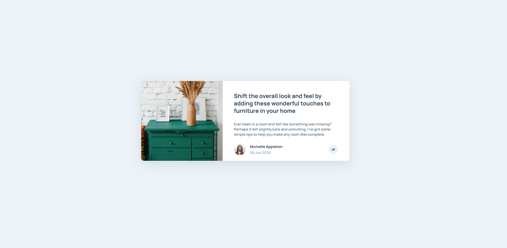

# articlePreview

The only JavaScript you'll need for this challenge is to initiate the share options when someone clicks the share icon.

Your users should be able to: 

- View the optimal layout for the component depending on their device's screen size
- See the social media share links when they click the share icon

-------------------
HTML
CSS
Javascript

-------------------

- [Live Site URL](https://articlepreviewfmentor.netlify.app/)
---------------------
What I most learn about:

1. Flex
2. Responsive Design
3. Javascript Basic
4. Javascript - "defer"

